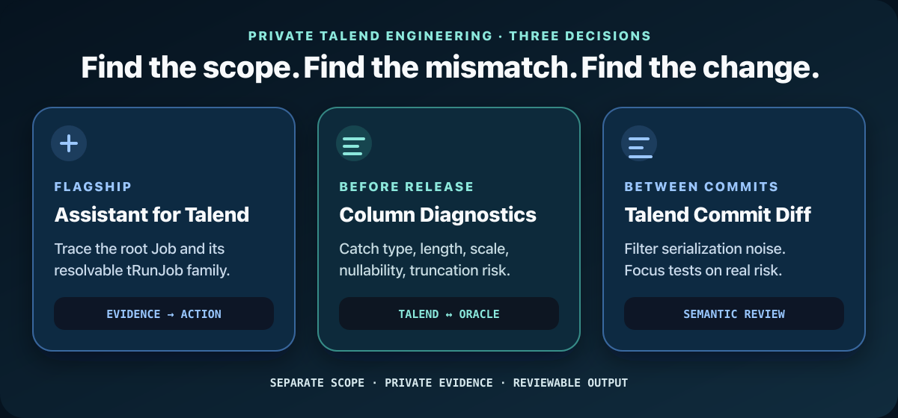
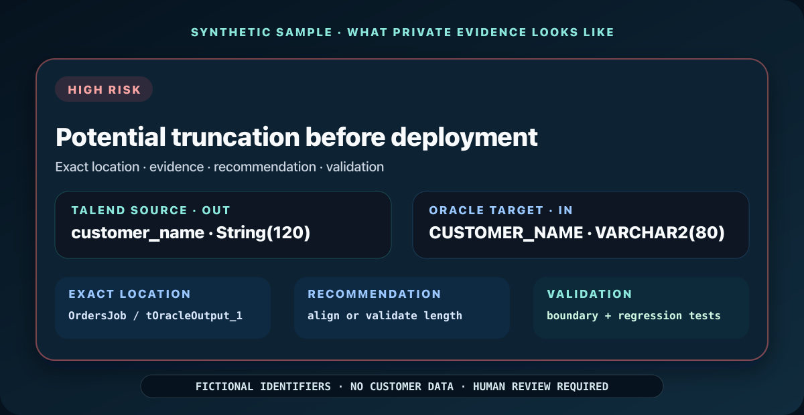
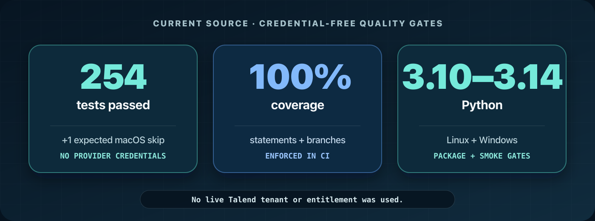

# Talend API + GitHub API — Free Read-Only CLI

<p align="center">
  
</p>

<p align="center">
  <strong>Inspect safely for free. Diagnose deeply in private.</strong><br>
  Local Studio · Public GitHub · Your authorized Talend API account
</p>

<p align="center">
  <a href="https://www.linkedin.com/in/emrekaany/"></a>
  <a href="#run-free"></a>
</p>

<p align="center">
  <a href="https://github.com/emrekaany/talend-cloud-github-api-starter/actions/workflows/ci.yml"></a>
  <a href="https://github.com/emrekaany/talend-cloud-github-api-starter/actions/workflows/codeql.yml"></a>
  
  <a href="LICENSE"></a>
</p>

<p align="center"><a href="docs/quickstart-tr.md">Türkçe</a> · <a href="docs/services.md">Private products</a> · <a href="https://github.com/emrekaany/talend-cloud-github-api-starter/discussions">Public discussion</a></p>

## Private Talend engineering



- **Assistant for Talend** traces Job families and turns exact ETL, SQL, runtime, and risk evidence into prioritized guidance.
- **Column Diagnostics** catches Talend ↔ Oracle type, length, precision, nullability, and truncation risks before release.
- **Talend Commit Diff** compares immutable revisions, filters known serialization noise, and focuses regression testing on semantic change.



These private products are separately scoped, customer-authorized, and designed for approved evidence. Deterministic local rules are available; an AI layer is optional.

<p align="center"><a href="docs/services.md"><strong>Explore the private toolkit →</strong></a></p>

## Run free

```bash
python3 -m venv .venv
source .venv/bin/activate
python -m pip install "https://github.com/emrekaany/talend-cloud-github-api-starter/archive/refs/tags/v0.2.0.zip"
talend-api demo
```

No Talend account or token is required. The demo uses synthetic fixtures and makes no provider request. [Windows and full setup →](docs/quickstart.md)

| Read path | Needs |
| --- | --- |
| `talend-api demo` | Nothing |
| `talend-api local jobs …` | Authorized local Studio files |
| `talend-api github jobs …` | Public repo + exact ref/path |
| `talend-api talend workspaces` | Your endpoint + environment token |

> GET only · No job execution · No mutation · No business rows · No hosted upload · No telemetry

## Verified



Current source: **254 credential-free tests passed**, plus one expected macOS filesystem skip. CI enforces **100% statement and branch coverage**. No live Talend tenant or entitlement was used for this verification.

[Security](docs/security-model.md) · [Architecture](docs/architecture.md) · [Talend API](docs/talend-api.md) · [GitHub API](docs/github-api.md) · [Examples](docs/examples.md) · [Changelog](CHANGELOG.md)

Never post credentials, source files, logs, screenshots, private URLs, client identifiers, or database details on public GitHub.

<sub>Independent MIT-licensed project. Not affiliated with, sponsored by, or endorsed by Qlik. Talend and Qlik are trademarks of their respective owners. Provider access and licenses are not included.</sub>
