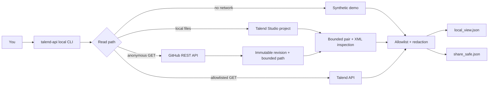

# How to Use Talend API + GitHub API from the Command Line

**Talend API + GitHub API CLI** is a free, independent Python command-line starter for reading Talend operational metadata, inspecting Talend Studio projects on your machine, and finding supported Talend job artifacts in public GitHub repositories.

This project is not affiliated with, sponsored by, or endorsed by Qlik. The `talend-api` executable belongs to this repository; it is **not** Qlik's separate Talend CommandLine product.

[](https://github.com/emrekaany/talend-cloud-github-api-starter/actions/workflows/ci.yml)
[](https://github.com/emrekaany/talend-cloud-github-api-starter/actions/workflows/codeql.yml)


Learn the complete workflow without an account or token, then choose only the read path you need:

- inspect a local Talend Studio project without network access;
- inspect a public GitHub repository through anonymous GitHub API requests;
- list workspaces, tasks, or recent runs that your own Talend API account is authorized to see.

> **The boundary is the feature:** the CLI reads metadata. It does not run tasks, publish jobs, execute embedded SQL or Java, export business rows, upload a project, or mutate provider resources.

[Quickstart](#quickstart) · [Türkçe hızlı başlangıç](docs/quickstart-tr.md) · [Local project](#inspect-a-local-talend-project) · [Talend API](docs/talend-api.md) · [Security](docs/security-model.md) · [Capabilities](docs/supported-capabilities.md) · [Private Assistant for Talend](docs/services.md)

## Problem

Talend work is often split across three evidence sources:

| Source | Question answered | Credential |
| --- | --- | --- |
| Local Talend Studio project | Which supported `.properties` / `.item` job pairs exist on disk? | None |
| GitHub REST API | Which supported Talend job artifacts exist at this exact public Git revision? | None for public repositories |
| Talend API | Which workspaces, tasks, and recent executions can my account see? | Your own eligible account and local token |

Copy-paste scripts tend to blur those sources, expose more metadata than the
question requires, and make it hard to prove which revision or authorization
boundary produced a result. This CLI keeps the three sources separate, applies
bounded read-only parsing, and produces a narrow output contract. You can learn
the complete command surface from synthetic data before connecting a provider.

## Architecture



Operational API metadata and Studio source metadata are not interchangeable.
They meet only at the output-policy layer. `local_view.json` preserves the
bounded evidence needed for local inspection; `share_safe.json` is constructed
separately from an identity-free allowlist. Read the [architecture
notes](docs/architecture.md) for trust boundaries and failure behavior.

## Quickstart

Prerequisite: Python 3.10+. Package installation may download Python
dependencies; the demo itself uses bundled synthetic fixtures and makes no
Talend or GitHub request.

The shortest verified path installs the published `v0.2.0` source snapshot
directly from GitHub into an isolated environment:

```bash
python3 -m venv .venv
source .venv/bin/activate
python -m pip install "https://github.com/emrekaany/talend-cloud-github-api-starter/archive/refs/tags/v0.2.0.zip"
talend-api demo
python -m json.tool demo-output/share_safe.json
```

Windows PowerShell:

```powershell
python -m venv .venv
.\.venv\Scripts\Activate.ps1
python -m pip install "https://github.com/emrekaany/talend-cloud-github-api-starter/archive/refs/tags/v0.2.0.zip"
talend-api demo
```

Prefer a clone when you want the documentation, examples, or development
checks locally:

```bash
git clone https://github.com/emrekaany/talend-cloud-github-api-starter.git
cd talend-cloud-github-api-starter
python3 -m venv .venv
source .venv/bin/activate
python -m pip install .
talend-api demo
```

The demo writes `demo-output/local_view.json` and
`demo-output/share_safe.json` from newly authored synthetic metadata. No
account, token, tenant, client file, or provider request is involved. Editable
installation (`python -m pip install -e .`) is reserved for contributors.

Read the [full quickstart](docs/quickstart.md) for installation checks and all four command paths.

### Command map

```text
talend-api demo
talend-api local jobs PATH --path-prefix process
talend-api github jobs OWNER/REPOSITORY --ref main --path-prefix path/to/project/process
talend-api talend workspaces
talend-api talend tasks --help
talend-api talend runs --help
```

| Command | Network | Token | Intended use |
| --- | --- | --- | --- |
| `demo` | No | No | Verify installation, parser, output policy, and CLI flow using synthetic fixtures |
| `local jobs` | No | No | Inspect supported Talend Studio artifacts below a bounded local path |
| `github jobs` | Anonymous GitHub GET | No | Inspect a public repository at one immutable revision |
| `talend ...` | Allowlisted Talend API GET | Yes | Read operational metadata visible to the caller |

### Inspect a local Talend project

Point the CLI at a Talend Studio project you are authorized to inspect. `--path-prefix process` keeps the scan on the project's job directory.

```bash
talend-api local jobs /path/to/TALEND_PROJECT \
  --path-prefix process
```

This path does not call Talend or GitHub. The scanner reads only supported `.properties` / `.item` candidates below the selected scope, refuses path escapes, does not follow source as executable code, and never runs SQL, Java, shell, mapper expressions, or Talend jobs.

Use synthetic fixtures when documenting or reporting a problem. Do not publish a real project, output, path, client name, connection value, or job content.

### Inspect a public GitHub repository

Use a narrow repository-relative Talend project path:

```bash
talend-api github jobs OWNER/REPOSITORY \
  --ref main \
  --path-prefix path/to/talend-project/process
```

The command uses anonymous GitHub REST API reads, resolves the requested ref to an immutable commit, and reads only bounded metadata under the selected path. It does not clone or execute the repository. Private-repository authentication is intentionally outside this starter.

After installing, this repository provides a credential-free public smoke
target with synthetic fixtures:

```bash
talend-api github jobs emrekaany/talend-cloud-github-api-starter \
  --ref refs/tags/v0.2.0 \
  --path-prefix examples/fixtures \
  --output-dir github-self-test
```

GitHub currently permits **60 unauthenticated REST requests per hour per
originating IP**, while this CLI stops one scan after at most **40 requests**.
Shared networks and hosted runners can therefore inherit a depleted provider
budget. Published `v0.2.0` stops safely on a temporary GitHub `502`, `503`, or
`504`; it does not retry automatically. The current `v0.2.1` source adds at
most two retries inside that same budget and still fails safely rather than
returning a partial inventory.

Read [GitHub API workflow](docs/github-api.md) for revision pinning, budgets, and safe failures.

### Read Talend API metadata

The live Talend API commands require credentials and access that **you already control**. This free repository does not create or grant a Talend account, license, trial, personal access token (PAT), service account token (SAT), role, or endpoint entitlement.

Talend API endpoints are hosted at a regional URL shaped like:

```text
https://api.<region>.cloud.talend.com
```

Configure the exact host and supported credential type for your own account as explained in [Talend API setup](docs/talend-api.md). Then inspect the command surface without placing a secret on the command line:

```bash
talend-api talend workspaces --help
talend-api talend tasks --help
talend-api talend runs --help
```

The implementation is tested with synthetic fixtures and mocked HTTP transports. A passing local test suite is not a claim that a live tenant, subscription, region, credential type, role, or endpoint entitlement has been authenticated. Confirm those details in an account you are authorized to use and in current Qlik documentation.

### Included capabilities

| Capability | Included | Guardrail |
| --- | :---: | --- |
| Offline, credential-free demo | Yes | Bundled synthetic fixtures only |
| Local Talend Studio project inspection | Yes | Required bounded scope; no source execution |
| Public GitHub Talend artifact inspection | Yes | Anonymous GET, immutable revision, bounded traversal |
| Talend workspaces, tasks, and recent runs | Yes | Exact regional host, environment credential, allowlisted GET only |
| `.properties` / `.item` relationship validation | Yes | Ambiguous or unsupported pairs fail closed |
| Structural XML metadata parsing | Yes | DTD/entities disabled; embedded code is data only |
| Separate local and share-safe JSON | Yes | Share-safe output uses an explicit identity-free allowlist |
| Start, stop, publish, update, delete, or upload | **No** | Mutation is outside the public contract |
| Business-row or raw-log export | **No** | Outside the metadata contract |
| Private GitHub authentication | **No** | Requires a separate security design |

See the [complete capability matrix](docs/supported-capabilities.md).

## Measured evidence

The published `v0.2.0` source snapshot and the current `v0.2.1` source tree
were independently rechecked on **2026-08-24** without Talend or GitHub
credentials. These are reproducibility and engineering-quality measurements—not
customer results, adoption metrics, or proof of access to a live Talend tenant.

| Gate | Observed result |
| --- | --- |
| Published download/install | Anonymous HTTPS clone and tagged-source ZIP install succeeded in fresh environments; `v0.2.0` demo and local synthetic-project flows completed |
| Automated behavior tests | `254 passed` plus 1 expected macOS filesystem skip in the current `v0.2.1` source across GitHub, local-project, Talend API, output-policy, workflow, CLI, and XML-safety paths |
| Statement and branch coverage | `100.00%`: `1,225/1,225` statements and `384/384` branches, with an enforced `100%` floor |
| Static quality | Ruff lint and format checks passed; mypy reported no issues in 13 source files |
| Security/dependency checks | Semgrep reported zero findings; Bandit completed with one documented environment-variable-name false-positive suppression; pip-audit found no known vulnerability in the resolved dependency set |
| Package build | Source distribution and wheel built successfully; Twine and wheel-content checks passed; a fresh-wheel install, `pip check`, help/version commands, offline demo, and local synthetic-project flow completed |
| Public-safety scan | Gitleaks reported no finding in the current source tree or the published Git history; reviewed internal-name, credential, and machine-path patterns returned no match |
| Live public GitHub path | The anonymous CLI read the repository's `v0.2.0` synthetic fixture at an immutable revision: 1 job, 2 components, 0 warnings, and no credential |
| Hosted checks | Published `v0.2.0` CI and CodeQL runs completed successfully; the badges above show the latest `main` status |

The repository defines Linux tests for Python 3.10–3.14, Windows smoke tests
for Python 3.10–3.14, a Python 3.10 minimum-dependency gate, a clean-wheel
package job, and CodeQL. Live Talend
authentication and endpoint entitlement remain unverified because this review
correctly used no authorized tenant or secret. The successful anonymous GitHub
smoke is point-in-time interoperability evidence, not a provider SLA or a
guarantee that another IP will have remaining anonymous quota.

## Limitations

The controls below narrow the tool's exposure, but they do not turn it into a
security-certified product or make every output safe to share automatically:

- Live provider requests are constrained to explicit GET allowlists.
- Talend credentials come from the local process environment, not CLI arguments or fixtures.
- The demo and local-project path do not contact a provider.
- GitHub reads stay public, path-bounded, and pinned to one immutable commit.
- XML parsing rejects DTDs and external entities; embedded content is never executed.
- Share-safe output is built from an allowlist, not by serializing the local view.
- Redirects, oversized responses, incomplete trees, ambiguous pairs, and unsupported formats fail closed.
- Remote clients deliberately ignore ambient proxy environment variables; a network that requires an HTTP proxy needs an explicitly reviewed deployment path.
- No telemetry or hosted token/file ingestion is included.

Review [SECURITY.md](SECURITY.md) and the [security
model](docs/security-model.md) before live use.

### Provider and product boundaries

The repository is free and MIT-licensed. That does **not** make provider access free:

- Talend API use may require an eligible account or trial, a supported PAT or SAT, roles, and endpoint entitlements.
- Anonymous GitHub API access is subject to GitHub's 60-request/hour/IP primary limit and additional provider limits; one CLI scan has a lower 40-request cap.
- Your organization's network, licensing, data-handling, and authorization policies still apply.

The project is an educational, read-only metadata starter—not an ETL engine,
scheduler, migration engine, official Qlik tool, data observability platform,
or proof of live-provider access. It does not inspect private GitHub
repositories, guarantee compatibility with every Talend artifact/version, or
replace a security, licensing, or data-handling review.

## Documentation

- [Quickstart](docs/quickstart.md)
- [Türkçe hızlı başlangıç](docs/quickstart-tr.md)
- [Talend API setup](docs/talend-api.md)
- [GitHub API workflow](docs/github-api.md)
- [Architecture](docs/architecture.md)
- [Supported capabilities](docs/supported-capabilities.md)
- [Security model](docs/security-model.md)
- [Safe examples](docs/examples.md)
- [Troubleshooting](docs/troubleshooting.md)
- [Support](SUPPORT.md)
- [Contributing](CONTRIBUTING.md)
- [Provenance](PROVENANCE.md) and [third-party notices](THIRD_PARTY_NOTICES.md)

## FAQ

### Is `talend-api` an official Qlik command?

No. It is this repository's independent Python CLI. It is not Qlik's separate Talend CommandLine product and does not imply affiliation with Qlik.

### Can I use the demo without Talend access?

Yes. `talend-api demo` is synthetic and offline after dependencies are installed. Local project inspection and anonymous public-GitHub inspection also do not require a Talend token.

### Does the free repository include free Talend API access?

No. Live Talend API commands require your own eligible account, supported credential, roles, and endpoint entitlement. Qlik controls those requirements.

### Does it read business data processed by a job?

No. It reads operational metadata and supported Studio artifact structure. It does not extract rows flowing through an ETL job.

### Can it mutate Talend or GitHub resources?

No. Live HTTP paths are GET-only and the CLI has no start, stop, publish, update, delete, or upload command.

### Can I attach a real Talend file to an issue?

No. Never post a real `.item`, `.properties`, log, screenshot, token, private URL, output file, or client/environment identifier. Reproduce with newly authored synthetic data.

## Start free — scale when the problem demands it

1. Run `talend-api demo` without an account or token.
2. Choose one authorized read path: local Studio project, public GitHub
   repository, or your own eligible Talend API account.
3. Review the local and share-safe outputs before deciding whether metadata
   inventory is enough for your problem.

If the free CLI solves the problem, keep using it. If your decision requires
semantic diff, cross-job dependency analysis, migration-readiness assessment,
data-quality diagnostics, or a customer-authorized private deployment,
**Assistant for Talend** is the separate paid, private path.

[Compare the free and private scopes](docs/services.md), start a
[non-sensitive discussion](https://github.com/emrekaany/talend-cloud-github-api-starter/discussions),
or open a GitHub Issue for a reproducible bug or documentation correction. If
the starter is useful, star or watch the repository so future public releases
are easier to find.

Never put credentials, client artifacts, live identifiers, private repository
URLs, or real Talend files in a public discussion or issue.

## Trademark notice

Talend and Qlik are trademarks of QlikTech International AB or its affiliates. All other trademarks are the property of their respective owners. This independent project is not affiliated with, sponsored by, or endorsed by Qlik.
