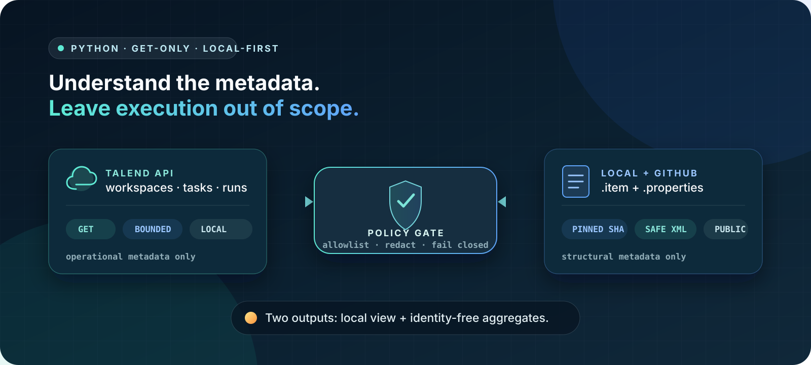
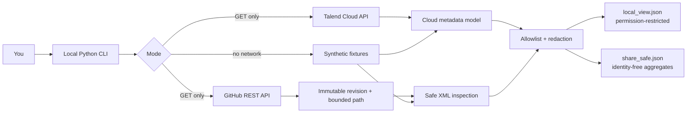

# How to Use Talend Cloud + GitHub APIs with Python

**A free, read-only Python starter for exploring Qlik Talend Cloud® operational metadata and Talend® Studio project artifacts stored in GitHub.** This independent project is not affiliated with, sponsored by, or endorsed by Qlik.

[](https://github.com/emrekaany/talend-cloud-github-api-starter/actions/workflows/ci.yml)
[](https://github.com/emrekaany/talend-cloud-github-api-starter/actions/workflows/codeql.yml)



Run a realistic offline demo with synthetic data, inspect `.item` / `.properties` pairs from a public GitHub repository, or query the Talend Cloud API from your own machine using an account you already control.

> **The boundary is the feature:** this starter reads metadata. It does not run tasks, publish jobs, execute embedded SQL or Java, export business rows, or upload your project to a hosted service.

[2-minute quickstart](#two-minute-quickstart) · [Türkçe hızlı başlangıç](docs/quickstart-tr.md) · [Security model](docs/security-model.md) · [Capability matrix](docs/supported-capabilities.md) · [FAQ](#faq) · [Private Assistant for Talend](docs/services.md)

## Why this exists

Talend work often spans two systems that answer different questions:

- **Talend Cloud API:** What environments, workspaces, tasks, and executions can my account see?
- **GitHub REST API:** Which Talend Studio job artifacts exist at this exact Git revision, and what safe structural metadata can be extracted from them?

This repository keeps those paths separate, makes every live path read-only, and provides a credential-free demo before you connect anything.

## Two-minute quickstart

Prerequisites: Python 3.10+ and a local clone or download of this repository. The initial install may download Python packages; the demo itself uses bundled synthetic fixtures and does not call Talend Cloud or GitHub.

```bash
cd talend-cloud-github-api-starter
python3 -m venv .venv
source .venv/bin/activate
python -m pip install -e .
talend-api-starter demo
```

The command writes `demo-output/local_view.json` and `demo-output/share_safe.json` from synthetic cloud metadata and a synthetic Talend Studio job, then prints both paths. No account, token, tenant, client file, or provider API call is needed.

```bash
python -m json.tool demo-output/share_safe.json
```

On Windows PowerShell, use `.\.venv\Scripts\Activate.ps1` instead of `source .venv/bin/activate`. See the [full quickstart](docs/quickstart.md) for verification, common errors, and the next read-only commands.

## Choose your path

| Mode | What it reads | Network | Credential | Best for |
| --- | --- | --- | --- | --- |
| `demo` | Bundled synthetic cloud responses and Studio artifacts | None after installation | None | Learning the complete workflow safely |
| `github jobs` | `.item` and `.properties` metadata in a **public** GitHub repository | GitHub GET requests | None for public repositories | Inspecting source structure at an exact revision |
| `cloud ...` | Operational metadata exposed by allowlisted Talend Cloud endpoints | Talend Cloud GET requests | Local Talend personal access token | Inventorying resources your account may already read |

The starter is free and has no paid feature gate. Talend Cloud access is not supplied by this project: live commands require your own eligible account, API permissions, and any license or trial required by Qlik. GitHub also applies its own API limits.

## What you can do

| Capability | Included | Guardrail |
| --- | :---: | --- |
| Run an offline, credential-free demo | Yes | Synthetic fixtures only |
| List Talend Cloud workspaces, tasks, and recent runs | Yes | Allowlisted GET requests only |
| Find Talend Studio jobs in a public GitHub repository | Yes | Required path scope and bounded traversal |
| Resolve a branch/tag to an immutable commit | Yes | Tree and blobs stay pinned to that revision |
| Pair `.properties` descriptors with `.item` artifacts | Yes | Ambiguous or unsupported pairs fail closed |
| Parse safe structural metadata | Yes | DTD/entities disabled; embedded code is never executed |
| Produce a share-safe summary | Yes | Allowlists and redaction exclude sensitive values |
| Start/stop tasks, publish, update, delete, or upload | **No** | No mutation commands in this starter |
| Export business row data or raw logs | **No** | Outside the metadata contract |
| Inspect private repositories | **No** | Public GitHub repositories only in this starter |

See the [complete capability and non-capability matrix](docs/supported-capabilities.md).

## Architecture



Cloud operational metadata and Studio source metadata remain distinct models. They meet only at the output policy layer; the project does not pretend the Talend Cloud API returns Studio source files.

Read the [architecture notes](docs/architecture.md) for trust boundaries, failure behavior, and the provider split.

## Read a public GitHub repository

Use a narrow Talend project path. The command resolves the requested ref, pins the scan to an immutable commit, and reads only bounded metadata below that path.

```bash
talend-api-starter github jobs OWNER/REPOSITORY \
  --ref main \
  --path-prefix path/to/talend-project/process
```

No token is required for a public repository. Rate limits and repository size limits still apply. Private repository support is intentionally outside this starter. See [GitHub API workflow](docs/github-api.md).

## Read Talend Cloud metadata locally

Live mode uses an exact Talend API base URL and a personal access token from your local environment. Start with [Talend Cloud API setup](docs/talend-cloud-api.md), then inspect command-specific options locally:

```bash
talend-api-starter cloud workspaces --help
talend-api-starter cloud tasks --help
talend-api-starter cloud runs --help
```

The project does not include a Talend Cloud account, license, trial, role, or endpoint entitlement. A valid token does not guarantee that every endpoint is authorized for your account.

Every Talend request sends the documented `talend-version: 2021-03` header. The implementation follows the official [Orchestration API](https://talend.qlik.dev/apis/orchestration/2021-03/) and [Processing API](https://talend.qlik.dev/apis/processing/2021-03/) references rather than legacy `/tmc` endpoints.

## Example: identity-free share-safe output

This is the aggregate shape produced by the bundled offline fixture. It is not a screenshot, benchmark, client result, live environment, or adoption metric:

```json
{
  "cloud_aggregates": {
    "runs": {
      "execution_destination_counts": {
        "REMOTE_ENGINE": 1
      },
      "execution_status_counts": {},
      "execution_type_counts": {
        "SCHEDULED": 1
      },
      "record_count": 1,
      "status_counts": {
        "execution_successful": 1
      }
    },
    "tasks": {
      "record_count": 1
    },
    "workspaces": {
      "record_count": 1
    }
  },
  "output_class": "share_safe",
  "schema_version": "1.0",
  "source": {
    "provider": "offline_synthetic_fixture"
  },
  "studio_aggregates": {
    "component_count": 2,
    "job_count": 1
  },
  "warning_count": 0
}
```

The two files have deliberately different audiences:

| File | Audience | Content boundary |
| --- | --- | --- |
| `local_view.json` | **Local-only** inspection; written permission-restricted where the filesystem supports it | May include account-visible names/IDs, provider metadata, repository revision/path details, and synthetic job labels in demo mode |
| `share_safe.json` | Candidate for sharing **after human review** | Identity-free aggregate counts/statuses/types only; no job label, path, repository identity, commit SHA, workspace/task name, or raw ID |

Neither file contains the Talend token or raw `.item` / `.properties` bytes. Context/connection values, SQL, Java, shell, mapper expressions, raw XML, raw logs, and personal account fields are excluded from `share_safe.json`.

More examples: [safe output examples](docs/examples.md).

## Security promise

The public starter is deliberately narrow:

- Live provider requests are constrained to an explicit GET allowlist.
- The offline demo performs no provider API calls.
- Credentials stay in the local process and are never accepted by a hosted demo.
- Tokens are not placed in URLs, command arguments, output, telemetry, or fixtures.
- GitHub reads are pinned to one immutable commit and one required project path.
- XML parsing rejects DTDs and external entities; extracted SQL, Java, shell, and expressions are never run.
- Share-safe output is built from an allowlist, not by serializing the full local view.
- Unexpected redirects, oversized responses, truncated trees, ambiguous pairs, and unsupported formats fail closed.

These controls reduce risk; they are not a security certification. Review [SECURITY.md](SECURITY.md) and the [threat model](docs/security-model.md) before using live mode.

## Honest limits

This repository is an educational and operational-metadata starter. It is **not**:

- an ETL engine, scheduler, migration engine, or data observability platform;
- a way to read the business rows processed by a Talend job;
- a substitute for Qlik documentation, support, licensing, or access control;
- a deep semantic diff, lineage, dependency, migration-readiness, or data-quality product;
- proof that a tenant, region, role, or API entitlement is available to you;
- permission to upload employer, customer, or third-party assets.

Provider APIs, limits, terms, and entitlements can change. Follow the official references linked from the provider guides and confirm live behavior in an account you are authorized to use.

## Documentation

- [Quickstart](docs/quickstart.md)
- [Türkçe hızlı başlangıç](docs/quickstart-tr.md)
- [Architecture](docs/architecture.md)
- [Supported capabilities](docs/supported-capabilities.md)
- [Talend Cloud API setup](docs/talend-cloud-api.md)
- [GitHub API workflow](docs/github-api.md)
- [Security model](docs/security-model.md)
- [Safe examples](docs/examples.md)
- [Troubleshooting](docs/troubleshooting.md)
- [Support](SUPPORT.md)
- [Contributing](CONTRIBUTING.md)
- [Provenance](PROVENANCE.md) and [third-party notices](THIRD_PARTY_NOTICES.md)

## FAQ

### Is this an official Talend or Qlik project?

No. It is an independent starter and is not affiliated with, sponsored by, or endorsed by Qlik.

### Is it really free?

The repository is MIT-licensed and has no paid feature gate. Live Talend Cloud access may require your own eligible paid account or trial, PAT, roles, and endpoint entitlements. GitHub applies API limits to public requests.

### Does it read the business data processed by a job?

No. It reads operational metadata from Talend Cloud and structural metadata from Studio source artifacts in public GitHub repositories. It does not extract rows flowing through an ETL job.

### Can it start, stop, publish, update, or delete anything?

No. The live HTTP surface is GET-only, and the CLI intentionally has no mutation commands.

### Do I need a token?

Not for `demo` or anonymous inspection of a public GitHub repository. Local Talend Cloud commands require `TALEND_TOKEN` and the exact `TALEND_BASE_URL` for an account you are authorized to use.

### Why are there two JSON files?

`local_view.json` is permission-restricted and intended for local inspection. `share_safe.json` uses a stricter identity-free aggregate allowlist. The latter still needs human review: recognized run status/type buckets and counts can remain sensitive.

### Can I inspect a private GitHub repository?

Not with this starter. Private repositories, enterprise authentication, and private-network deployment belong to a separately reviewed private scope.

### Can I attach a real Talend file to an issue?

No. Never post real `.item`, `.properties`, logs, screenshots, tokens, private URLs, or client/environment identifiers. Reproduce with newly authored synthetic data.

## Need deeper Talend analysis?

**Assistant for Talend** is the paid, private path for teams that need semantic diff, dependency analysis, migration-readiness assessment, data-quality diagnostics, or deployment inside a private environment. It is intentionally separate from this free starter.

[See the private service boundary](docs/services.md). For a non-sensitive first conversation, use [GitHub Discussions](https://github.com/emrekaany/talend-cloud-github-api-starter/discussions). **Never post tokens, client files, logs, private repository URLs, tenant/workspace/run IDs, or `.item` / `.properties` contents in a Discussion or public issue.**

## Trademark notice

Qlik Talend Cloud® and Talend® are trademarks of QlikTech International AB or its affiliates. All other trademarks are the property of their respective owners. This independent project is not affiliated with, sponsored by, or endorsed by Qlik.
