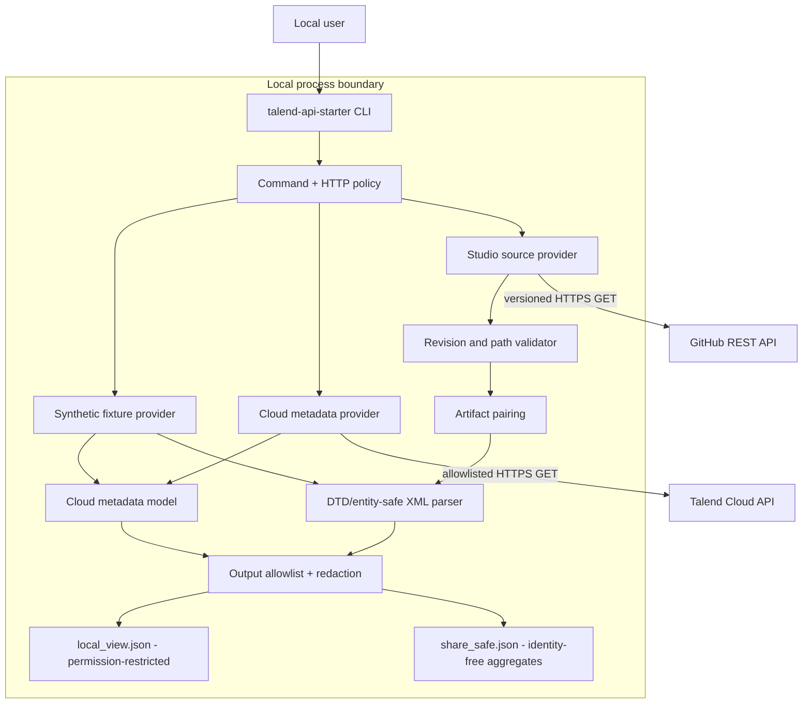
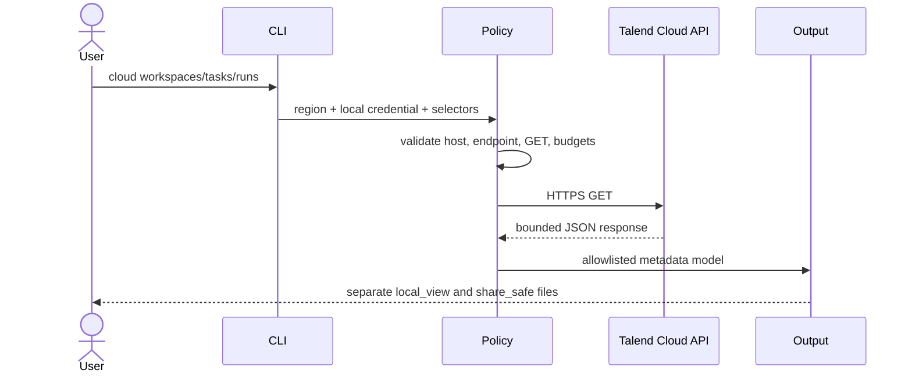
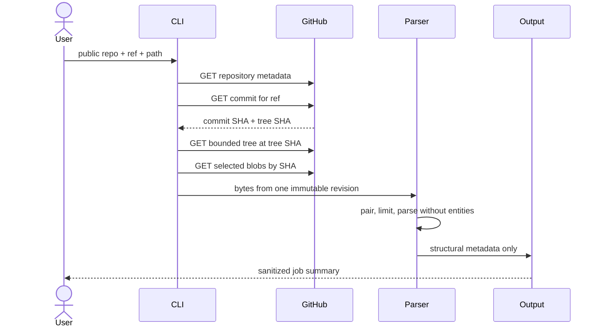

# Architecture

The design has one central rule: Talend Cloud operational metadata and Talend Studio source metadata are different products of different APIs. They remain separate until a narrow output policy turns them into a safe summary.

## System view

## Components and responsibilities

| Component | Responsibility | Must not do |
| --- | --- | --- |
| CLI | Validate mode and user-supplied selectors | Accept a token as a positional/visible argument |
| Command policy | Permit only documented read operations | Manufacture arbitrary endpoints from provider data |
| HTTP policy | Enforce host, GET method, redirect refusal, timeout, response-byte, and request budgets | Follow redirects or automatically retry a failed request |
| Cloud provider | Read account-visible operational metadata | Fetch Studio source or mutate resources |
| Studio source provider | Resolve a Git revision and read bounded tree/blob data | Clone/execute the repository or drift between refs |
| Pairing/parser | Validate `.properties` ↔ `.item` relationships and extract structural metadata | Resolve external entities or execute embedded content |
| Output policy | Build a permission-restricted local view and a separate identity-free aggregate projection | Serialize provider objects or raw XML into the share-safe file |

## Non-negotiable invariants

1. **GET-only live access.** A network call must match both an allowlisted host and an allowlisted GET endpoint template.
2. **Immutable Git reads.** A branch or tag is resolved once; every tree and blob belongs to the resulting commit/tree chain.
3. **Bounded input.** Path, depth, tree entry, response-byte, blob count/byte, XML node/depth/text, and request budgets are finite.
4. **Untrusted source.** XML, names, descriptions, filenames, tags, and errors can all be hostile input.
5. **No embedded execution.** SQL, Java, shell, mapper expressions, and job definitions are data, never commands.
6. **Separate output models.** A share-safe summary is built from an allowlist, not from the local view.
7. **Fail closed.** A truncated tree, redirect outside policy, ambiguous pair, unsupported schema, or exceeded budget does not produce a success result.

## Talend Cloud request path

An API response cannot redirect the client to a new provider host or supply a URL for the client to follow. Authorization is never forwarded across hosts.

## GitHub source request path

The scanner does not use a later branch state after resolving the commit. A recursive tree marked `truncated` is not accepted as a complete inventory.

## Trust boundaries

| Boundary | Trusted | Untrusted |
| --- | --- | --- |
| Local configuration | Exact HTTPS Talend API host after pattern validation | Environment contents, user input, proxies |
| Provider response | HTTP status after policy checks | JSON fields, URLs, names, errors, sizes |
| Git source | Exact SHA relationship after validation | Paths, XML, encodings, embedded expressions |
| Output | Explicit allowlisted fields | Raw provider objects and exception strings |
| Public support | Synthetic minimal reproduction | Client files, secrets, live identifiers, private URLs |

## Failure behavior

Errors should identify the category—authentication, authorization, not found, rate limit, timeout, budget, truncation, unsupported format, or pair mismatch—without echoing credentials or raw provider content. One malformed artifact may be isolated, but the tool must not call a partial tree a complete inventory.

## Deployment boundary

The free starter is a local CLI. There is no public hosted form for Talend tokens or private source. A private deployment, if separately contracted through [Assistant for Talend](services.md), is a different product boundary and does not silently expand the permissions of this repository.
