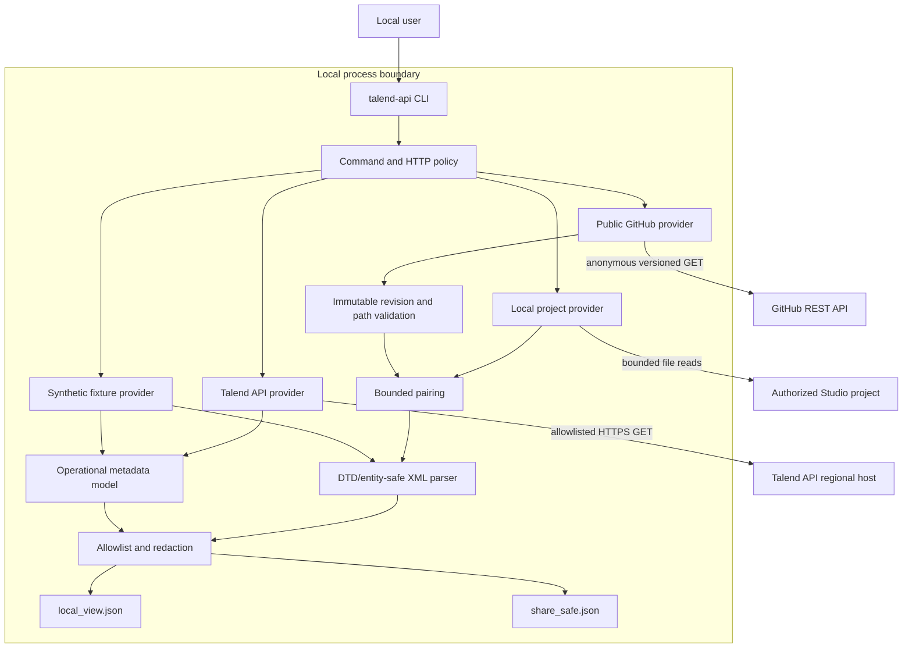
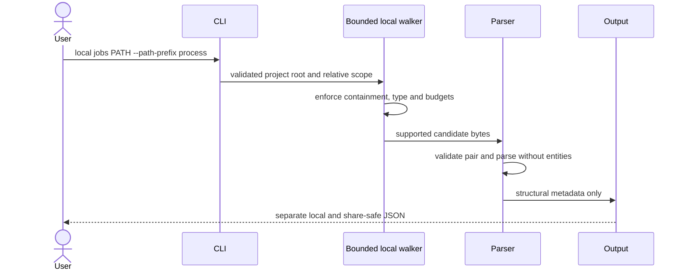
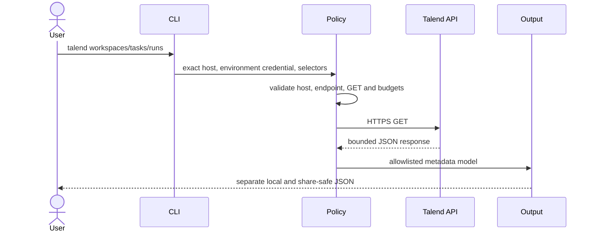
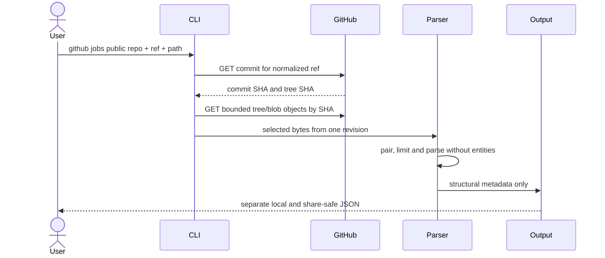

# Architecture

The CLI keeps three evidence sources separate: local Talend Studio artifacts, public GitHub artifacts, and Talend API operational metadata. They meet only at a narrow output-policy layer.

`talend-api` is this repository's independent Python command. It is not Qlik's separate Talend CommandLine product.

## System view

## Components and responsibilities

| Component | Responsibility | Must not do |
| --- | --- | --- |
| CLI | Validate mode, path, and selectors | Accept a token as a visible argument |
| Local project provider | Read bounded supported artifact candidates below an authorized path | Traverse escapes, follow source as code, or run Talend/Git |
| GitHub provider | Resolve one ref and read bounded public tree/blob data | Authenticate private repositories, clone, execute, or mix revisions |
| Talend API provider | Read allowlisted operational metadata from the exact validated host | Mutate resources or claim access beyond the caller's entitlement |
| HTTP policy | Enforce host, GET method, redirects, timeouts, response size, and request budgets | Follow redirects or retry without a caller decision |
| Pairing/parser | Validate `.properties` / `.item` evidence and extract structural metadata | Resolve entities or execute embedded SQL, Java, shell, or expressions |
| Output policy | Build a local view and a separate identity-free projection | Serialize raw provider objects or XML into share-safe output |

## Non-negotiable invariants

1. **GET-only live access.** A provider request must match both an allowlisted host and an allowlisted GET endpoint template.
2. **No-network local modes.** The demo and local-project commands do not contact Talend or GitHub.
3. **Immutable Git reads.** A branch or tag is resolved once; every accepted tree and blob belongs to the resulting commit chain.
4. **Bounded input.** Files, paths, depth, tree entries, bytes, XML nodes/text, responses, pages, and request counts have finite ceilings.
5. **Untrusted content.** XML, names, paths, descriptions, tags, provider fields, and errors can be hostile.
6. **No embedded execution.** SQL, Java, shell, mapper expressions, and Talend jobs are data, never commands.
7. **Separate outputs.** Share-safe data is constructed from an allowlist; it is not a lightly redacted local view.
8. **Fail closed.** Redirects, incomplete trees, path escapes, ambiguous pairs, unsupported schemas, and exceeded budgets do not become successful complete results.

## Local project path

The local path does not call a provider, invoke Git, launch Talend, or execute project content. Absolute local roots are not needed in share-safe output.

## Talend API path

The exact base URL must match `https://api.<region>.cloud.talend.com`. A response cannot redirect authorization to another host or supply a new call target.

Default automated tests use mock transports and synthetic responses. They verify the client policy without claiming successful authentication against a live tenant.

## GitHub path

A recursive tree marked incomplete or truncated is not accepted as a complete inventory.

## Trust boundaries

| Boundary | Narrowly trusted evidence | Untrusted material |
| --- | --- | --- |
| Local project | Resolved containment and supported regular files after checks | Filesystem paths, symlinks, XML, embedded expressions |
| Talend configuration | Exact HTTPS regional API root after validation | Environment contents, token, user input, proxy/DNS state |
| Provider response | Status and bytes after policy checks | JSON fields, names, URLs, errors, sizes |
| Git source | Verified SHA relationships | Paths, encodings, XML, embedded source |
| Share-safe output | Explicit allowlisted fields | Raw/redacted provider objects, raw XML, exception strings |
| Public support | Newly authored synthetic reproduction | Secrets, real artifacts, outputs, live IDs, private URLs |

## Deployment boundary

The free project is a local CLI with no telemetry and no hosted token/file form. A separately contracted private deployment through [Assistant for Talend](services.md) is a different product boundary with its own authorization, architecture, and data-handling review. It does not expand this repository's permissions.
