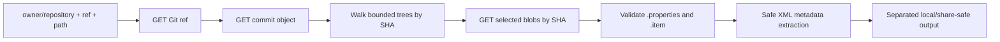

# GitHub API workflow

`talend-api github jobs` inspects supported Talend Studio `.item` / `.properties` artifacts in a **public** GitHub repository without cloning or executing it. Every artifact in one successful result is tied to one immutable commit.

## Command

```bash
talend-api github jobs OWNER/REPOSITORY \
  --ref main \
  --path-prefix path/to/talend-project/process
```

Use a path as close as practical to the relevant project's `process` directory. `OWNER/REPOSITORY`, `main`, and `path/to/...` are placeholders; replace them only with public source you are authorized to inspect.

This starter's GitHub mode is anonymous and public-only. There is no GitHub token field, private-repository authentication, clone, checkout, submodule execution, or workflow trigger.

## Read sequence



The implementation uses the versioned GitHub REST [Git References](https://docs.github.com/en/rest/git/refs), [Git Commits](https://docs.github.com/en/rest/git/commits), [Git Trees](https://docs.github.com/en/rest/git/trees), and [Git Blobs](https://docs.github.com/en/rest/git/blobs) endpoints. It sends GitHub's JSON media type and a pinned REST API version header. Treat any header-version update as a dependency change that requires review and tests; use GitHub's [REST API versioning guide](https://docs.github.com/en/rest/about-the-rest-api/api-versions) as the authority.

## Why the revision is pinned

A branch can move between requests. The client therefore:

1. normalizes the requested branch or tag;
2. resolves it to a commit SHA;
3. reads the root tree SHA from that commit;
4. descends the requested path using tree SHAs;
5. downloads selected blobs by SHA.

It does not resolve `main` again during the scan. This prevents one result from silently mixing files from different revisions.

## Scope and budgets

The reader enforces finite request, response-byte, tree-entry, depth, blob-count, per-blob, and total decoded-byte ceilings. Use `talend-api github jobs --help` and the installed revision as the source of truth for current values.

A scan that reaches a ceiling stops instead of reporting an incomplete inventory as complete. Narrow the path rather than bypassing a budget.

Paths must be repository-relative, normalized, and free of traversal, absolute-path, backslash, control-character, and duplicate-separator patterns. Git submodules are not followed as directories.

## Artifact relationship and parser boundary

A filename match is not sufficient evidence. For supported Talend formats, the parser uses the `.properties` descriptor's process reference to locate the exact `.item` artifact in the same commit tree and validates the relationship evidence available in that format.

Incomplete, contradictory, ambiguous, oversized, or unsupported evidence is isolated or rejected. The tool does not guess which similarly named source is correct.

The parser can encounter SQL, Java, shell, context values, connection parameters, mapper expressions, and other configuration inside XML. They remain untrusted data and are never executed. Raw artifact bytes and excluded values are not part of the documented output contracts.

## Output boundary

The permission-restricted local view may include safe structural labels and public revision/path details needed for local inspection. The separate share-safe projection keeps only identity-free aggregates and warnings. It excludes repository identity, ref, path, SHA, job labels, component names, and raw source.

Neither label removes the need for human review. Public source can still contain sensitive or legally restricted material, and aggregate structure can reveal architecture.

## Common failures

| Result | Meaning | Safe next step |
| --- | --- | --- |
| `not_found` | Repository, ref, or path is absent or not public | Confirm spelling and public visibility without posting a private URL |
| `rate_limited` | GitHub refused more anonymous calls | Wait for reset and narrow the path |
| request/tree/blob budget error | The selected scope exceeds a local ceiling | Select a smaller Talend project/process subtree |
| truncated/incomplete tree | GitHub did not return complete evidence | Stop; do not label the result complete |
| unsupported/pair mismatch | Encoding or artifact relationship cannot be proven safely | Create a new synthetic minimal reproduction |

See [Troubleshooting](troubleshooting.md) for safe issue contents.

## Provider and legal limits

Anonymous GitHub requests are subject to primary and secondary rate limits; use GitHub's current [REST API rate-limit documentation](https://docs.github.com/en/rest/using-the-rest-api/rate-limits-for-the-rest-api) as the authority.

Public visibility is not permission to copy, republish, or misuse repository content. Inspect only source you are authorized to analyze and follow its license, repository policy, employer/client obligations, and applicable law.
