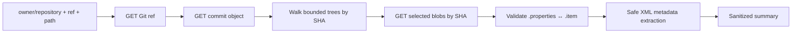

# GitHub API workflow

The GitHub path inspects Talend Studio `.item` and `.properties` artifacts in a **public** repository without cloning or executing the repository. Every file in one result belongs to one immutable commit.

## Command

```bash
talend-api-starter github jobs OWNER/REPOSITORY \
  --ref main \
  --path-prefix path/to/talend-project/process
```

Use a path as close as practical to the relevant Talend project's `process` directory. An empty or repository-wide scope increases API usage and the chance of hitting a safety budget.

Public mode is anonymous in this starter. There is no private repository token field or authenticated private-repository mode.

## Read sequence



The client uses the versioned [Git References](https://docs.github.com/en/rest/git/refs), [Git Commits](https://docs.github.com/en/rest/git/commits), [Git Trees](https://docs.github.com/en/rest/git/trees), and [Git Blobs](https://docs.github.com/en/rest/git/blobs) endpoints. Requests include `Accept: application/vnd.github+json` and `X-GitHub-Api-Version: 2026-03-10`. Treat an API-version change as a dependency upgrade: review and test it before changing the header. GitHub's [REST API versioning guide](https://docs.github.com/en/rest/about-the-rest-api/api-versions?apiVersion=2026-03-10) is the authority for supported version headers.

## Why pin the revision?

A branch can move between requests. The client therefore:

1. normalizes the requested branch or tag;
2. resolves it to a commit SHA;
3. reads the root tree SHA from that commit;
4. descends the requested path using tree SHAs;
5. downloads each selected blob by its SHA.

It does not resolve `main` again partway through a scan. This prevents a result from mixing files from different revisions.

## Scope and safety budgets

The current default reader is intentionally small:

| Budget | Default |
| --- | ---: |
| Provider requests | 40 |
| Tree entries inspected | 2,000 |
| Depth below the selected prefix | 8 |
| `.item` / `.properties` blobs | 100 |
| Decoded bytes per blob | 1 MB |
| Decoded bytes across selected blobs | 5 MB |
| JSON response bytes per request | 2 MB |

These are protective ceilings, not performance claims or recommended repository sizes. A scan that exceeds a budget stops rather than returning a result labeled complete.

Paths must be relative, normalized, and free of `..`, backslashes, control characters, duplicate separators, and absolute-path syntax. Git submodules are not followed as directories.

## Artifact pairing

A filename match alone is not enough. For supported Talend formats, the parser uses the `.properties` descriptor's process reference to locate the exact `.item` artifact in the same commit tree. It may also validate the version and reciprocal XMI identity where the format exposes them.

The result is `unsupported` or a pair-mismatch error when the evidence is incomplete or contradictory. The tool does not guess which similarly named source is correct.

## What the parser reads

The permission-restricted local view may include:

- job label, version, and status;
- component types, component instance names, and source paths;
- public repository owner/name, requested ref, and immutable revision details.

The separate share-safe file includes only identity-free job/component counts and a warning count. It excludes repository identity, ref/path/SHA, job label/version/status/path, component types, and component instance names.

The parser may encounter SQL, Java, shell, context values, connection parameters, mapper expressions, or other job configuration while processing XML. Those values are not execution instructions and are excluded from both documented output contracts.

## Common failures

| Result | Meaning | Safe next step |
| --- | --- | --- |
| `not_found` | Repository, ref, or path is absent or not public | Confirm spelling and public visibility without posting a private URL |
| `rate_limited` | GitHub refused more anonymous calls | Wait for reset; narrow the path; consult GitHub's rate-limit headers locally |
| `request_budget_exceeded` | The scan needed more calls than the local policy allows | Choose a narrower path |
| `tree_*_budget_exceeded` | The selected subtree is too broad or deep | Target a specific Talend project/process subtree |
| `blob_*_budget_exceeded` | Too many or too-large artifacts were selected | Narrow the path; do not bypass limits with client files in an issue |
| `unsupported_*` or pair mismatch | Encoding or Talend artifact relationship is not supported safely | Build a synthetic minimal reproduction before reporting |

See [Troubleshooting](troubleshooting.md) for safe issue reporting.

## Provider limits and terms

GitHub applies primary and secondary rate limits. Its public documentation currently describes a low unauthenticated limit per originating IP and higher limits for many authenticated user flows, but this starter intentionally remains anonymous/public-only. Limits can change; use the current [GitHub REST API rate-limit documentation](https://docs.github.com/en/rest/using-the-rest-api/rate-limits-for-the-rest-api) as the authority.

Repository visibility does not determine whether you have the legal right to reuse its contents. Inspect only repositories you are authorized to analyze and follow their license and applicable policies.
