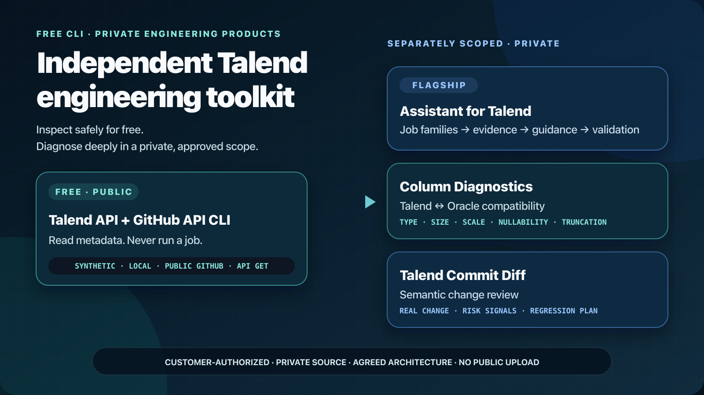
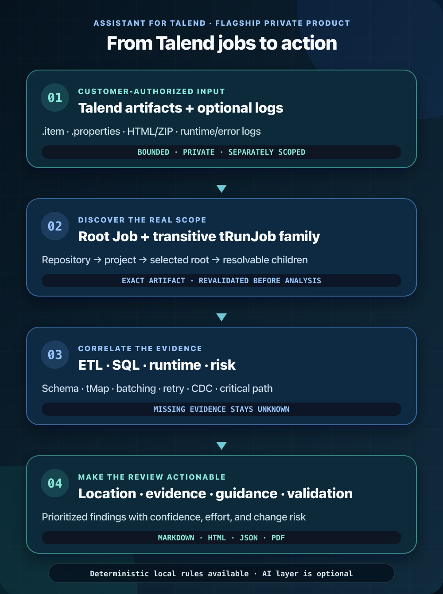
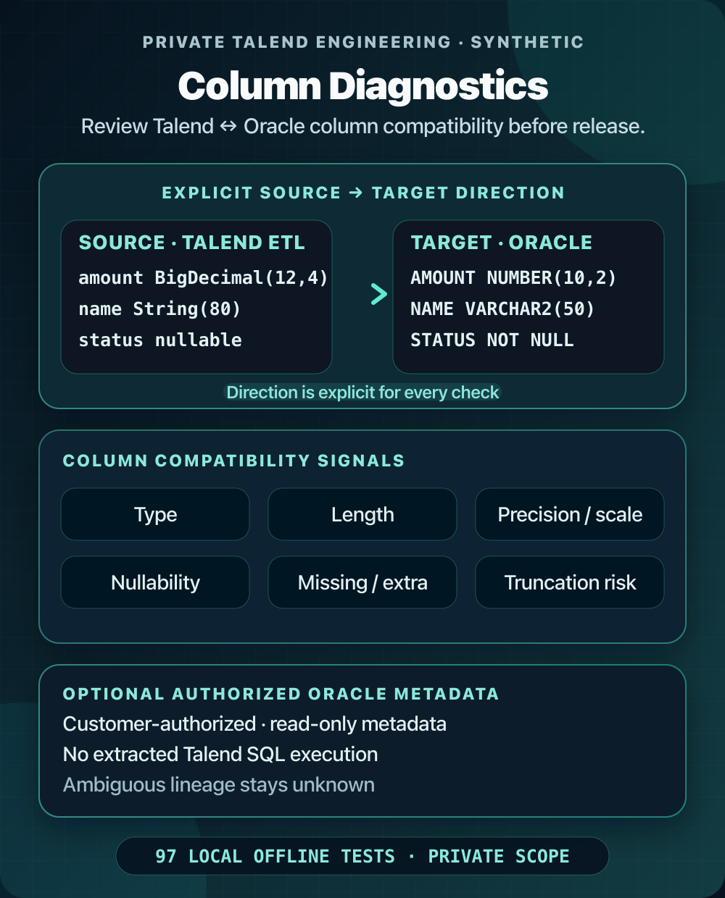
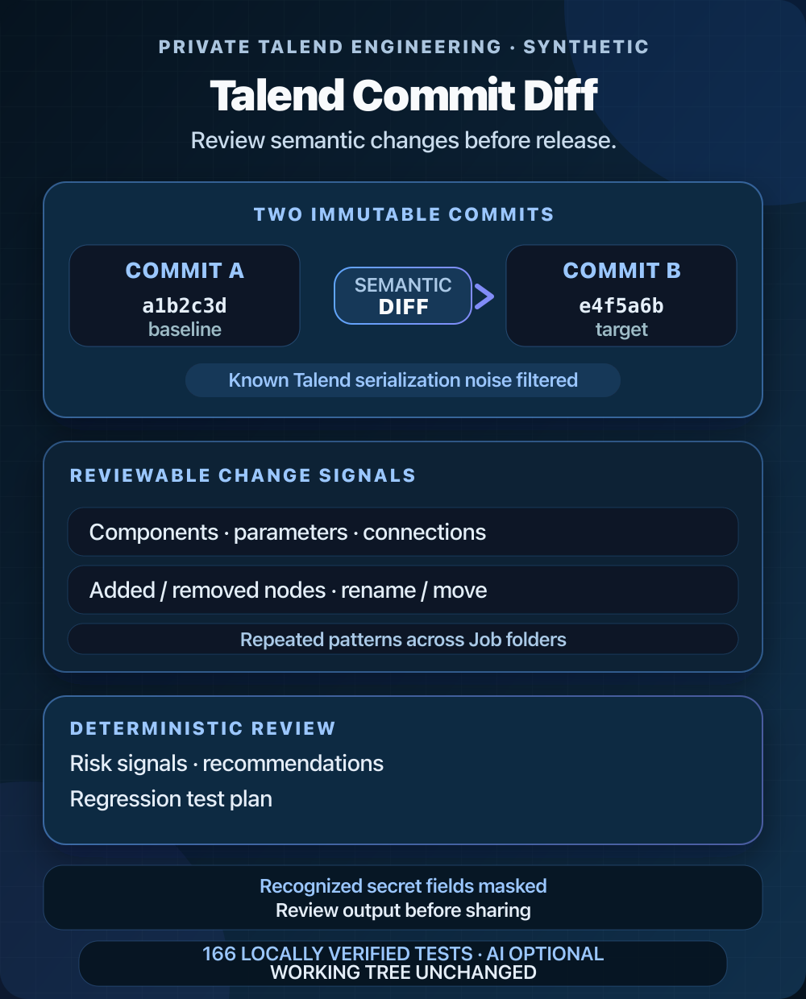

# Talend engineering products

The free **Talend API + GitHub API CLI** is the public starting point. It proves the read-only metadata foundation without requiring private source to be uploaded or leave the operator's machine.

Any proprietary project, runtime evidence, database metadata, or commit history shared with us or used in a paid engagement belongs in a separately approved private scope.

## Three private products

| Product | Decision it supports | Evidence it uses |
| --- | --- | --- |
| **Assistant for Talend** | What matters, why, and what should we validate next? | Talend artifacts, Job families, ETL/SQL signals, optional runtime logs |
| **Column Diagnostics** | Can a Talend ↔ Oracle column mismatch break or truncate a flow? | Talend schema metadata plus offline or authorized read-only Oracle metadata |
| **Talend Commit Diff** | What changed between two revisions, and what deserves regression testing? | Two immutable Git snapshots and semantic Talend structure |

Availability, pricing, deployment, support, authorization, and data handling are agreed separately. No public GitHub message authorizes access or analysis.

## Assistant for Talend

The flagship product discovers a selected root Job and every resolvable transitive `tRunJob` child, then correlates ETL, SQL, runtime, and risk evidence.

Outputs can include:

- the exact Job, component, property, or query location;
- evidence, confidence, effort, and change risk;
- implementation guidance and validation steps;
- navigable Markdown, HTML, JSON, or PDF reports.

Deterministic local rules are available. An AI layer is optional and requires an explicitly reviewed endpoint and deployment design.

## Column Diagnostics

Compares Talend ETL metadata with Oracle metadata for types, character lengths, numeric precision/scale, nullability, missing or extra columns, direction-aware truncation risk, and proven order mismatches.

Live Oracle access is optional. It requires a customer-authorized least-privilege account and uses only built-in allowlisted metadata `SELECT` statements; parameterized lookups use bind variables. Extracted Talend SQL is never executed or sent to Oracle. Dynamic or ambiguous lineage stays unresolved.

## Talend Commit Diff

Compares two immutable Git snapshots without switching the working tree. It filters known Talend serialization noise and reports semantic component, parameter, connection, node, rename/move, and repeated-pattern changes.

The deterministic review can produce risk signals, recommendations, and a regression test plan. It does not claim a complete runtime dependency graph. Private output may still contain operational identifiers and must be reviewed before sharing.

Point-in-time local verification on 2026-08-24: Diagnostics passed 97 offline tests; Commit Diff passed 166 tests. Those private suites are not included in this public repository.

## Free versus private

| Free public CLI | Private products |
| --- | --- |
| Synthetic demo | Proprietary, customer-authorized evidence |
| Bounded local/public inventory | Cross-Job and runtime analysis |
| Public GitHub artifacts | Commit intelligence on approved source |
| Supported Talend API GET metadata | Oracle ↔ Talend column diagnostics |
| No hosted upload or SLA | Agreed architecture, deliverables, and limits |

## Start without sharing sensitive data

Open a [non-sensitive GitHub Discussion](https://github.com/emrekaany/talend-cloud-github-api-starter/discussions) with only:

- the broad decision you need to make;
- an approximate project-size band;
- high-level deployment constraints;
- the product you want to explore;
- a request to establish a private contact path.

Never post credentials, source files, logs, screenshots, outputs, private URLs, client names, repository identifiers, database details, or real Talend artifacts on public GitHub.

## Independence notice

These are independent offerings, not Qlik products. They do not imply Qlik affiliation and do not replace provider licensing, support, security review, or product entitlements.
